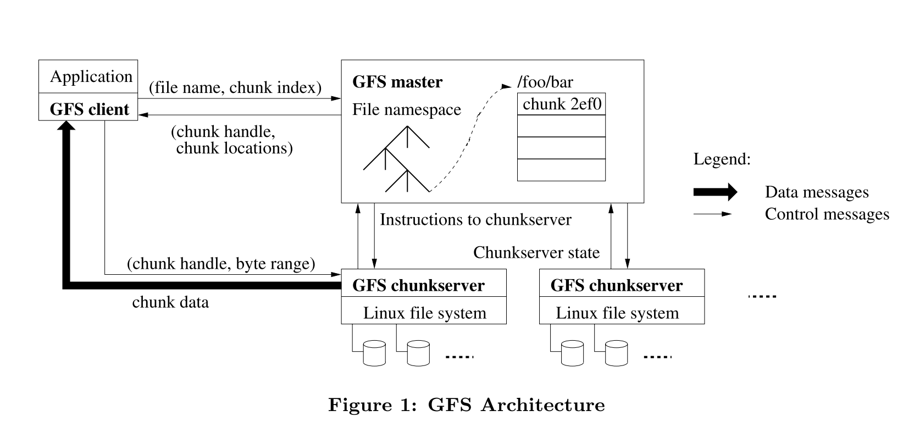

### [The Google File System](../../assets/pdfs/The-Google-File-System.pdf)

> Proceedings of the nineteenth ACM symposium on Operating systems principles, October 2003
>
> https://static.googleusercontent.com/media/research.google.com/zh-CN//archive/gfs-sosp2003.pdf

# The Google File System(GFS)
GFS 是为大规模分布式数据密集型应用设计的一个可扩展的分布式文件系统，它运行在廉价服务器上，提供容错机制，为大量客户端提供高性能存储服务。

GFS 与其它分布式文件系统具有相同的设计目标，如:

- 性能 (performance)
- 可扩展性 (scalability)
- 可靠性 (reliability)
- 可用性 (availability)

同时出于对 Google 业务及技术环境的观察，GFS 具有一些独特的设计要点。

## 设计假设

- **构建于廉价且易故障的组件之上**
  GFS 设计时考虑到硬件的不可靠性，假设组件失效是常态，而非例外。因此，系统架构需具备高容错性和自我修复能力。

- **存储大文件为主**
  GFS 主要针对存储大量大尺寸文件（通常大于100MB），这种设计适合于存储和处理大规模数据集，如网页索引和大型日志文件。

- **工作负载特性**
  GFS 的工作负载主要包括两种读取模式：
  - **大型流式读取**：适用于连续读取大文件，如视频流或大数据分析。
  - **小型随机读取**：适用于访问文件的特定部分，常见于数据库查询或索引检索。
    此外，系统还处理大量追加数据的顺序写入，这在日志记录或更新数据流中很常见。

- **并发追加数据的支持**
  GFS 必须支持多个客户端同时向同一文件追加数据，这意味着系统需要有高效的机制来处理并发写入，确保数据的一致性和完整性。

- **高持续带宽优先于低延迟**
  在GFS中，高数据传输速率比单次操作的响应时间更为关键。这是因为系统通常用于处理大规模数据，其中批量数据传输的效率远比单个请求的快速响应更重要。

这些假设反映了GFS设计时所考虑的实际应用场景，特别是在大规模数据处理和分布式计算环境中，如Google的搜索索引和广告系统。GFS通过这些设计原则实现了高性能、可扩展性和可靠性。

## 设计要点及架构

### 架构

### 架构要点

- **一个 Master，维护文件系统所有元数据**
    - 文件和 chunk 的命名空间
    - 文件到 chunk 的映射
    - chunk 到 chunkserver 的映射
    - ACL (Access Control List)
    - chunk 租约管理
    - 垃圾回收 (GC)

- **持久化元数据**
    - namespaces 和 file-to-chunk 映射记录在 operation log 中
    - chunk 到 chunkserver 的映射由 master 主动向 chunkserver 获取

- **多个 Chunkserver 存储文件数据**
    - 文件数据被分割为固定大小的 chunk (64MB)
    - 每个 chunk 有三个副本，分布于不同机器和机架

- **Master 和 Chunkserver 通信**
    - 通过心跳消息传递指令和收集状态

- **Client 和 Master 交互**
    - Client 从 Master 获取元数据
    - 数据的读写直接与 chunkserver 进行

- **Master 的恢复机制**
    - Master 可通过 operation log 恢复命名空间
    - 限制 operation log 大小，通过 checkpoint (类似 compact B-tree 形式) 减少恢复时间

- **一致性模型**
    - GFS 使用 atomic record append 实现较宽松的一致性模型
    - Record append 使用系统选择的偏移量而非应用指定

- **租约保证一致性**
    - GFS 使用租约确保多副本间更改顺序
    - Master 授权一个 chunk 为主副本，负责确定更改顺序

- **数据溢出处理**
    - 若 record append 超过 chunk 范围，所有副本填充至结尾
    - Record append 大小限制为 16MB，避免空间浪费

- **at-least-once 语义**
    - GFS 使用至少一次 (at-least-once) 语义
    - 冗余数据处理由应用程序负责

References
- [1] Google Filesystem: Architecture + Consistency Model Overview Part 1 & Part 2
- [2] GFS FAQ from MIT 6.824
- [3] Case Study GFS: Evolution on Fast-forward