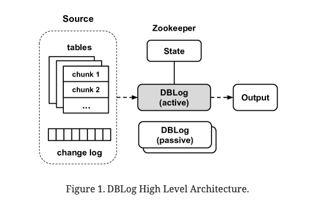
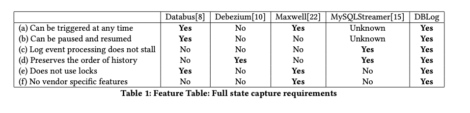
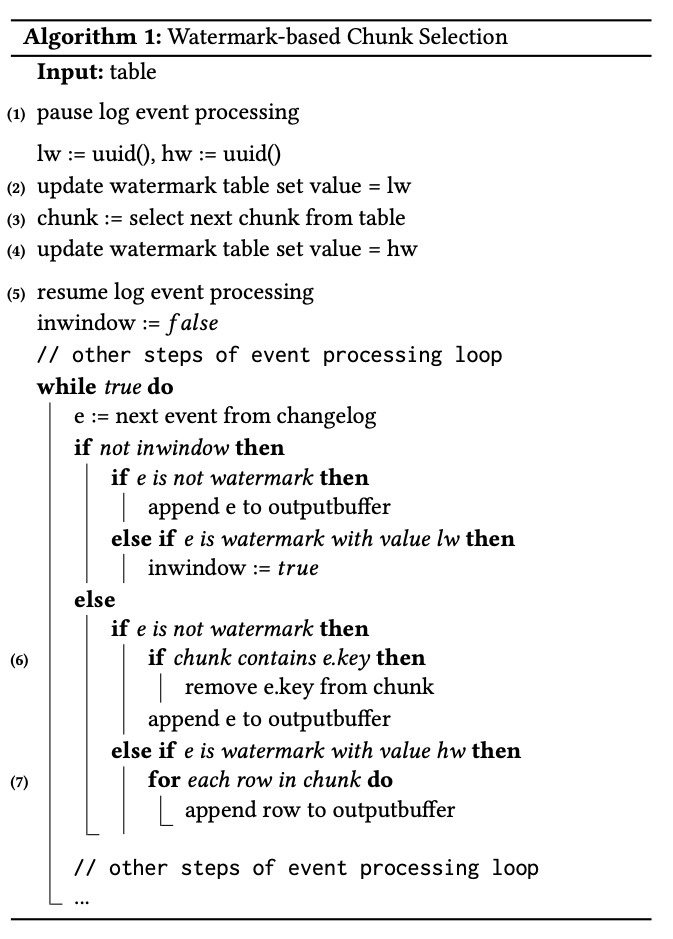
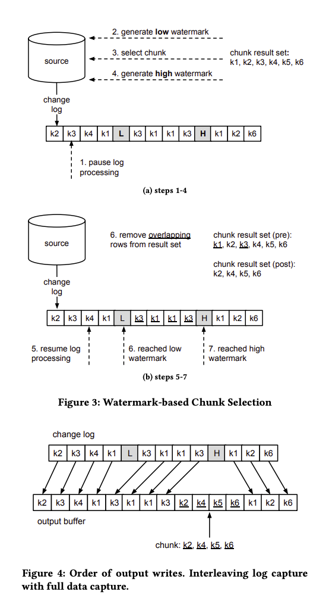

### [DBLog: AWatermark Based Change-Data-Capture Framework](../../assets/pdfs/DBLog_A_Watermark_Based_Change-Data-Capture_Framework.pdf)

> Andreas Andreakis, Ioannis Papapanagiotou. 2020
>
> https://arxiv.org/abs/2010.12597

# Dblog

## 一、简介

不同特性数据库之间的同步是一个普遍存在的需求。 双写和分布式事务是尝试解决此问题的一种模式，但这两种方式在可行性、鲁棒性和可维护性等方面或多或少存在一些问题；
CDC则是通过捕获数据库事务日志事件来达到下游数据库同步的另一种模式，但事务日志可能并非包含所有的变更事件（create/update/delete），因此需要同步数据库的全状态（full state）。

所以 Netfix 设计并开发了一种新的数据 CDC框架，即DBLog。DBLog 利用基于水印的方法，使我们能够将事务日志事件与直接从表中选择的行交错以捕获完整状态。我们的解决方案允许日志事件在处理选择时继续进行，而不会停止。可以随时对所有表、特定表或表的特定主键触发选择。 DBLog 以块的形式执行选择并跟踪进度，允许它们暂停和恢复。水印方式不使用锁，对源的影响最小。

DBLog 进程选择块并跟踪状态存储（当前为 Zookeeper）中的进度，允许它们从最后一个完成的块暂停和恢复。水印方法不使用表锁，因此对源数据库的影响最小。 DBLog 使用相同的格式将捕获的事件传送到输出中，无论源是事务日志还是表选择。输出可以是像 Kafka 这样的流（Wang et al., 2015），如果有多个事件消费者，这是一种常见的选择。然而，DBLog 也可以直接写入数据存储或 API。 DBLog 在设计时还考虑到了高可用性 (HA)，采用主动-被动架构，其中一个 DBLog 进程一次处于活动状态，多个被动进程处于备用状态，并且可以在需要恢复工作时接管。因此，下游消费者有信心在源发生更改后不久就收到行。图 1 描述了 DBLog 的高级架构。



## 其它同类型的产品



## Dblog

DBLog 通过事务日志捕获变更事件，通过 `select` 来获取数据的全状态。根据主键将表切分为多个 `chunk`，每个 chunk 的 select 和事务日志同时进行，为了保证事件的历史顺序，DBLog 在源数据库中维护了一个单行单列的表作为辅助，通过在 select 前后分别更新该记录使得在事务日志中多了两个事件 lw(低水位) 和 hw(高水位)，然后将查询出来的事件和 [lw, hw] 之间的事件做以下算法，生成一个新事件流。


paper 中的示例图 (Figure 3 && Figure 4) 非常明白地解释了上述算法:



算法正确性依赖数据库的 RC 或 RR 隔离级别，select 返回的 result set 是 (lw, hw) 之间的一个点的视图，我们以 RR 隔离级别分别用图示论证增改删的正确性:

1 insert log event

insert 日志在 select 之前，select 日志中能会包含该插入记录，因此从 result set 将其删除避免了重复插入。

```txt
 ---lw------select-------hw-----
        ^
        |
      insert
```

insert 日志在 select 之后，result set 中不含该插入记录，新的事件流只包含一次该记录。

```txt
 ---lw------select-------hw-----
                    ^
                    |
                  insert
```

2 update log event

update 日志在 select 之前，select 结果中包含了更新后的结果，而 update 日志包含了更新前后的数据，将 result set 中对应的记录删除，新的事件流中包含 update 后的记录，可保证正确性。

```txt
 ---lw------select-------hw-----
        ^
        |
      update
```

update 日志在 select 之后，select 中包含更新前的结果，将 result set 中对应的记录删除了老的值，但 update 日志包含了更改前后的新老数据，同样可以保证正确性。

```txt
 ---lw------select-------hw-----
                    ^
                    |
                  update
```

3 delete log event

delete 日志在 select 之前，result set 中不含该记录，新的事件流删除一个不存在的记录不影响正确性。

```txt
 ---lw------select-------hw-----
        ^
        |
      delete
```

delete 日志在 select 之后，result set 包含该记录，需要删除该记录来保证新的事件流先删除一个不存在的记录后又将该记录插入。

```txt
 ---lw------select-------hw-----
                    ^
                    |
                  delete
```

### More readings

- [1] [DBLog: A Generic Change-Data-Capture Framework](https://netflixtechblog.com/dblog-a-generic-change-data-capture-framework-69351fb9099b)
- [2] [Flink-CDC-DBLog无锁算法](https://miaowenting.site/2022/02/15/Flink-CDC-DBLog%E6%97%A0%E9%94%81%E7%AE%97%E6%B3%95/)
- [3] [Flink CDC 2.0 实现原理剖析](https://zhjwpku.com/2022/01/16/flink-cdc-2-0-analysis.html)
- [4] [DBLog: 一款通用的变化数据捕获框架](https://blog.victorchu.info/posts/d24c18fd/)
- [5] [DBLog: AWatermark Based Change-Data-Capture Framework paper](https://arxiv.org/abs/2010.12597)
